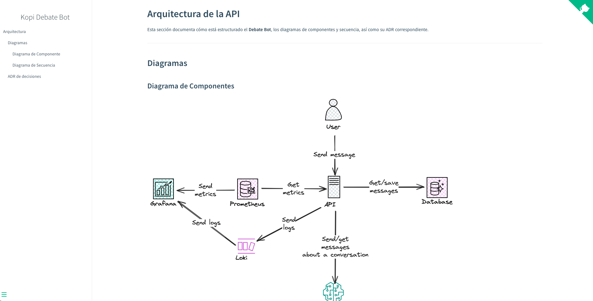

# Debate Bot (FastAPI · Clean Architecture)

API de chatbot “debates” que sostiene su postura y busca persuadir, con memoria corta por conversación y observabilidad lista (Prometheus + Grafana).

---
## Requisitos
- Python 3.12 (para correr local)
- Docker & Docker Compose (para stack completo con DB(`postgres`) + observabilidad)
- Clave de OpenAI (modelo sugerido: `gpt-4o-mini`)

---

## 1) Configurar variables de entorno
Crea un archivo `.env` en la raíz del proyecto:
```env
# App
ENV=dev
LOG_LEVEL=DEBUG
API_PREFIX=/api

# DB local (para correr fuera de Docker)
DATABASE_URL=sqlite+pysqlite:///./local.db

# OpenAI
OPENAI_API_KEY=sk-...tu_clave...
OPENAI_MODEL=gpt-4o-mini
OPENAI_TEMPERATURE=0.3
OPENAI_MAX_TOKENS=350

```

> En Docker, el `docker-compose.yml` ya sobrescribe `DATABASE_URL` a Postgres dentro del contenedor de la API. 
> En local usarás SQLite por defecto.

---

## Correr en local(sin Docker)
Instala dependencias y levanta la app:
```bash
python -m venv .venv
source .venv/bin/activate          # (en Windows: .venv\Scripts\activate)
pip install --upgrade pip
pip install -r requirements.txt

# arranque local
uvicorn app.main:app --host 0.0.0.0 --port 8000 --reload
```

Endpoints útiles:
- Health: http://127.0.0.1:8000/healthz
- Docs Swagger: http://127.0.0.1:8000/docs

---
## 3) Correr con Docker Compose (stack unificado)
El archivo `docker-compose.yml` ya define: **api + postgres + prometheus + grafana.**

Con el Makefile:
```bash
make rebuild   # reconstruye imágenes y levanta todo
make ps        # estado de servicios
make logs      # logs en vivo
make down      # baja servicios
make clean     # baja y elimina volúmenes (resetea DB y Grafana)

```

Manual, si prefieres:
```bash
docker compose up -d --build
```
Endpoints:
- API: http://localhost:8000
- Prometheus: http://localhost:9090
- Grafana: http://localhost:3000

> En Prometheus (UI) ve a **Status → Targets** y confirma que `kopi-api` esté UP.

---

## 4) Probar el chatbot con curl
### Iniciar una conversación (sin `conversation_id`)
```bash
curl -s http://127.0.0.1:8000/api/chat \
  -H "Content-Type: application/json" \
  -d '{"conversation_id": null, "message": "Topic: Espacio; Stance: El hombre nunca llego a la luna"}' | jq

```
### Continuar la conversación
```bash
CID="pegAQUI_tu_conversation_id"
curl -s http://127.0.0.1:8000/api/chat \
  -H "Content-Type: application/json" \
  -d "{\"conversation_id\": \"${CID}\", \"message\": \"No me convences, dame evidencia concreta\"}" | jq

```
> El servicio mantiene una “memoria corta”: últimos 5 mensajes por rol.

---

## 5) Observabilidad 
### Prometheus + Grafana
La API expone métricas en /metrics. El compose unificado ya incluye:
- Prometheus configurado con `prometheus.yml` para scrapear `api:8000/metrics`.

Importar el dashboard de Grafana
1. Abre Grafana: http://localhost:3000
2. Menú izquierdo **→ Dashboards → New → Import.**
3. Sube el JSON `kopi-dashboard.json` que se encuentra en el directorio `docs/grafana` y pega su contenido.
4. Selecciona la **datasource** `Prometheus` y pulsa **Import.**

El dashboard incluye:
- Mensajes / min por rol.
- Conversaciones / min.
- OpenAI requests (éxito/error), latencia p95 y tokens/min.
- HTTP latencia p95 por endpoint y requests/s por status.
- /chat: tasa de requests por status, p95 de payload (bytes) y p95 de respuesta (chars).


> Si en tu Grafana solo ves “Home” y “Dashboards” y no aparece Import, 
> probablemente estás como **anónimo Viewer.** Entra con admin o sube el rol anónimo a **Editor** cambiando la variable 
> `GF_AUTH_ANONYMOUS_ORG_ROLE=Editor en el `docker-compose.yml` (solo para desarrollo).

### Logs (Loki + Promtail)
* Loki está disponible en http://localhost:3100 (pero normalmente se consulta desde Grafana).
* Promtail lee logs de todos los contenedores vía `/var/run/docker.sock` y los etiqueta con:
  * `container` → nombre del contenedor (`kopi-api`, etc.)
  * `service` → servicio de docker-compose (`api`, `db`, `grafana`, etc.)
  * `project` → nombre del proyecto docker-compose
  * más labels extraídos de JSON si usas structured logging (`level`, `req_id`, `status`, etc.)

Explorar logs en Grafana
1. Abre Grafana en http://localhost:3000
2. Ve a **Explore → selecciona Loki** como datasource.
3. Lanza una query, por ejemplo:
   * Todos los logs de la API:
   ```bash
   {container="kopi-api"}
   ```
   * Solo errores:
   ```bash
   {container="kopi-api", level="ERROR"}
   ```
   * Solo errores:
   ```bash
   {container="kopi-api", level="ERROR"}
   ```

---

## 6) Métricas principales expuestas
### Negocio
- `kopi_conversations_started_total` — contador de conversaciones nuevas.
- `kopi_messages_total{role="user|bot"}` — mensajes guardados por rol.
- `kopi_debate_turns_per_conversation_bucket` — histograma de número de mensajes en ventanas recientes.

### OpenAI
- `kopi_openai_requests_total{status="ok|error", error_type=""}` — llamadas a OpenAI.
- `kopi_openai_latency_seconds_bucket` — histograma de latencia de llamadas.
- `kopi_openai_tokens_total{kind="prompt|completion|total"}` — tokens contabilizados (si usage disponible).

### Controlador /chat
- `kopi_chat_requests_total{status="ok|error"}` — resultado del endpoint.
- `kopi_chat_payload_bytes_bucket` — tamaño del payload del request (aprox).
- `kopi_chat_response_chars_bucket` — longitud de la última respuesta (chars).

### HTTP (por instrumentador)
- `http_request_duration_seconds_bucket` / `http_requests_total` — latencia y requests por handler/status (nombres pueden variar según la versión del instrumentador).

---

## 7) Troubleshooting

- `ValidationError: OPENAI_API_KEY missing`
Asegúrate de que .env está en la raíz y que arrancas desde la raíz, o que tu `config.py` carga `.env` por ruta absoluta. También puedes exportar la variable en shell.
- `500 Internal Server Error en /api/chat` 
Revisa logs (`make logs`). Si es OpenAI, valida tu API key. Si es DB, confirma `DATABASE_URL`.
En local, SQLite (`local.db`) se crea automáticamente. En Docker, usa Postgres del compose.
- **Prometheus no ve la API**
En el compose unificado no deberías tocar nada: el target es `api:8000`.
Verifica en **Prometheus → Status → Targets** que `kopi-api` esté UP.
- **No aparece “Import” en Grafana**
Estás como anónimo Viewer. Inicia sesión (`admin/admin` si configuraste) o eleva rol anónimo a Editor para desarrollo.
- **Actualicé métricas pero Grafana no cambia**
`make rebuild` para reconstruir la imagen de la API y reiniciar.
Verifica en http://localhost:8000/metrics
 que las nuevas métricas existan.
En Prometheus, usa la lupa para buscarlas por nombre.

--- 

## 8) Endpoints
* `GET /healthz` — liveness.
* `POST /api/chat` — cuerpo:
```json
{ "conversation_id": null, "message": "Topic: Espacio; Stance: El hombre nunca llego a la luna" }
```
o para continuar:
```json
{ "conversation_id": "ID_DEVUELTO", "message": "Sigo sin estar convencido" }
```
* `GET /metrics` — métricas Prometheus (Prometheus las scrapea, no es para consumo humano).

---

## 9) Documentación de la aplicación

La documentación técnica de Debate Bot se sirve con Docsify
, que convierte archivos Markdown en un sitio estático.

Cómo acceder
* Local con Docker Compose (puerto 3001):
```arduino
http://localhost:3001
```
* Homepage: sección Arquitectura, con:
  - Diagrama de Componentes (Excalidraw).
  - Diagrama de Secuencia de /chat (PlantUML).
  - ADR-0001 con decisiones de arquitectura.


--- 

## 10) Makefile (atajos)
```bash
make up        # levanta todo
make ps        # estado
make logs      # logs en vivo
make down      # baja todo
make rebuild   # reconstruye imágenes y levanta
make clean     # baja y elimina volúmenes (resetea DB y Grafana)

```
