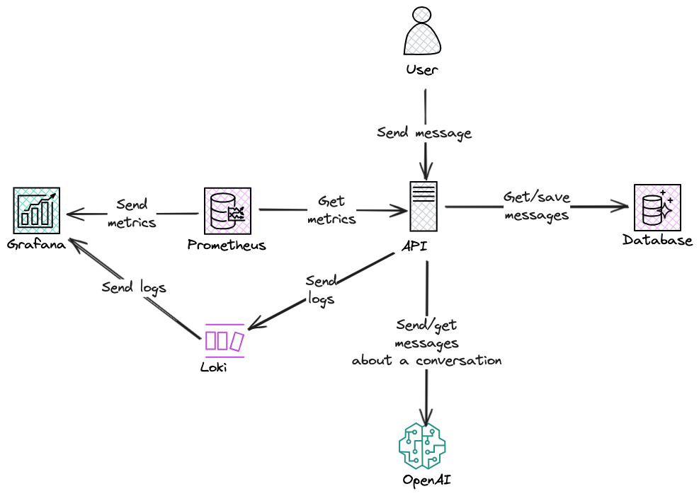

# Arquitectura de la API

Esta sección documenta cómo está estructurado el **Debate Bot**, los diagramas de componentes y secuencia, así como su ADR correspondiente.

---

## Diagramas

### Diagrama de Componentes



### Diagrama de Secuencia


```pgsql
Client → FastAPI (/api/chat) → Router
  → Depends(get_debate_service → DB Session, Repos, OpenAI client)
  → DebateService.handle
      ↳ parse topic/stance
      ↳ ConversationRepository.create/get → DB
      ↳ MessageRepository.add(user) → DB
      ↳ MessageRepository.last_n → DB
      ↳ OpenAI (system + history) → reply (+ métricas + logs)
      ↳ MessageRepository.add(bot) → DB
      ↳ MessageRepository.last_n → DB
  → construir ChatResponse → 200 OK
(middleware: logs de duración / instrumentador: métricas HTTP)

```
