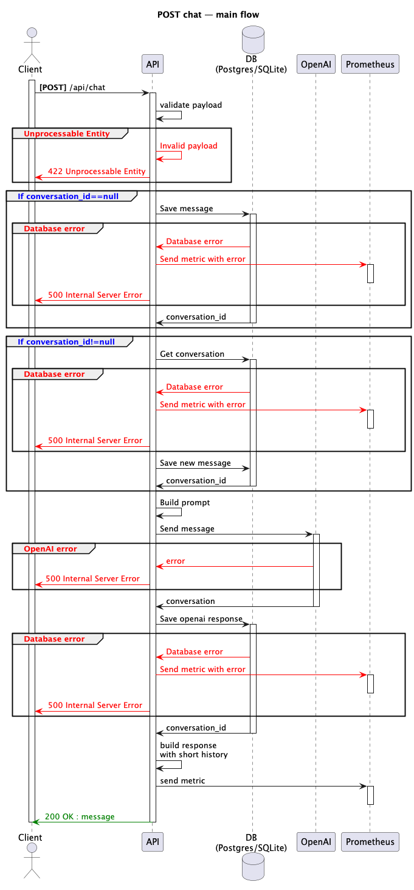

# Arquitectura de la API

Esta sección documenta cómo está estructurado el **Debate Bot**, los diagramas de componentes y secuencia, así como su ADR correspondiente.

---

## Diagramas

### Diagrama de Componentes

```plantuml
@startuml KopiComponents
skinparam componentStyle rectangle
skinparam wrapWidth 200
title Kopi Debate Bot — Component Diagram

package "FastAPI App (Kopi)" {
  [main.py\n(FastAPI, routers, middleware)]
  [chat controller\n/app/controllers/chat.py]
  [DebateService\n/app/services/chat.py]
  [OpenAI Adapter\n/app/infrastructure/llm/openai_client.py]
  [Repos SQLAlchemy\n/app/repositories/sql.py]
  [DB Session\n/app/infrastructure/db.py]
  [Pydantic Settings\n/app/core/config.py]
  [Metrics\n/app/core/metrics.py]
  [Logging\n/app/infrastructure/logging.py]
  [RequestID Middleware\n/app/core/middleware.py]
}

node "Database" as DB {
  [PostgreSQL (docker)] as PG
  [SQLite (local dev)] as SQLITE
}

cloud "OpenAI API" as OPENAI

node "Observability" {
  [Prometheus]
  [Grafana]
  [Loki]
  [Promtail]
}

main.py --> chat controller
chat controller --> DebateService
DebateService --> "uses" OpenAI Adapter
DebateService --> "uses" Repos SQLAlchemy
Repos SQLAlchemy --> DB Session
DB Session --> PG
DB Session --> SQLITE

OpenAI Adapter --> OPENAI

main.py --> Pydantic Settings
DebateService --> Pydantic Settings

Metrics ..> Prometheus : expose /metrics
Grafana ..> Prometheus : datasource
Promtail ..> Loki : push logs
Grafana ..> Loki : datasource

Logging ..> stdout
stdout ..> Promtail : docker logs

@enduml
```
### Diagrama de Secuencia


```pgsql
Client → FastAPI (/api/chat) → Router
  → Depends(get_debate_service → DB Session, Repos, OpenAI client)
  → DebateService.handle
      ↳ parse topic/stance
      ↳ ConversationRepository.create/get → DB
      ↳ MessageRepository.add(user) → DB
      ↳ MessageRepository.last_n → DB
      ↳ OpenAI (system + history) → reply (+ métricas + logs)
      ↳ MessageRepository.add(bot) → DB
      ↳ MessageRepository.last_n → DB
  → construir ChatResponse → 200 OK
(middleware: logs de duración / instrumentador: métricas HTTP)

```
