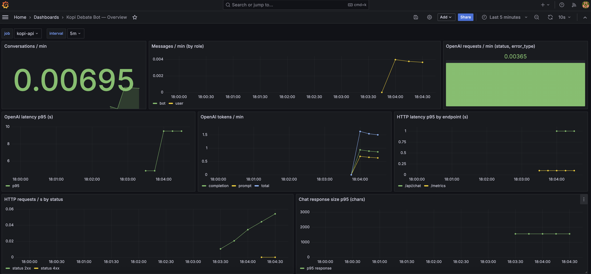
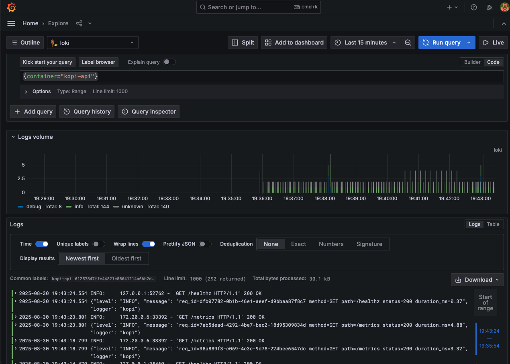

# Observabilidad 

## Prometheus + Grafana
La API expone métricas en /metrics. El compose unificado ya incluye:
- Prometheus configurado con `prometheus.yml` para scrapear `api:8000/metrics`.

Importar el dashboard de Grafana
1. Abre Grafana: http://localhost:3000
2. Menú izquierdo **→ Dashboards → New → Import.**
3. Sube el JSON `kopi-dashboard.json` que se encuentra en el directorio `docs/grafana` y pega su contenido.
4. Selecciona la **datasource** `Prometheus` y pulsa **Import.**

El dashboard incluye:
- Mensajes / min por rol.
- Conversaciones / min.
- OpenAI requests (éxito/error), latencia p95 y tokens/min.
- HTTP latencia p95 por endpoint y requests/s por status.
- /chat: tasa de requests por status, p95 de payload (bytes) y p95 de respuesta (chars).



> Si en tu Grafana solo ves “Home” y “Dashboards” y no aparece Import, 
> probablemente estás como **anónimo Viewer.** Entra con admin o sube el rol anónimo a **Editor** cambiando la variable 
> `GF_AUTH_ANONYMOUS_ORG_ROLE=Editor en el `docker-compose.yml` (solo para desarrollo).

## Logs (Loki + Promtail)
* Loki está disponible en http://localhost:3100 (pero normalmente se consulta desde Grafana).
* Promtail lee logs de todos los contenedores vía `/var/run/docker.sock` y los etiqueta con:
  * `container` → nombre del contenedor (`kopi-api`, etc.)
  * `service` → servicio de docker-compose (`api`, `db`, `grafana`, etc.)
  * `project` → nombre del proyecto docker-compose
  * más labels extraídos de JSON si usas structured logging (`level`, `req_id`, `status`, etc.)

Explorar logs en Grafana
1. Abre Grafana en http://localhost:3000
2. Ve a **Explore → selecciona Loki** como datasource.
3. Lanza una query, por ejemplo:
   * Todos los logs de la API:
   ```bash
   {container="kopi-api"}
   ```
   * Solo errores:
   ```bash
   {container="kopi-api", level="ERROR"}
   ```
   * Solo errores:
   ```bash
   {container="kopi-api", level="ERROR"}
   ```

---

## Métricas principales expuestas
### Negocio
- `kopi_conversations_started_total` — contador de conversaciones nuevas.
- `kopi_messages_total{role="user|bot"}` — mensajes guardados por rol.
- `kopi_debate_turns_per_conversation_bucket` — histograma de número de mensajes en ventanas recientes.

### OpenAI
- `kopi_openai_requests_total{status="ok|error", error_type=""}` — llamadas a OpenAI.
- `kopi_openai_latency_seconds_bucket` — histograma de latencia de llamadas.
- `kopi_openai_tokens_total{kind="prompt|completion|total"}` — tokens contabilizados (si usage disponible).

### Controlador /chat
- `kopi_chat_requests_total{status="ok|error"}` — resultado del endpoint.
- `kopi_chat_payload_bytes_bucket` — tamaño del payload del request (aprox).
- `kopi_chat_response_chars_bucket` — longitud de la última respuesta (chars).

### HTTP (por instrumentador)
- `http_request_duration_seconds_bucket` / `http_requests_total` — latencia y requests por handler/status (nombres pueden variar según la versión del instrumentador).
